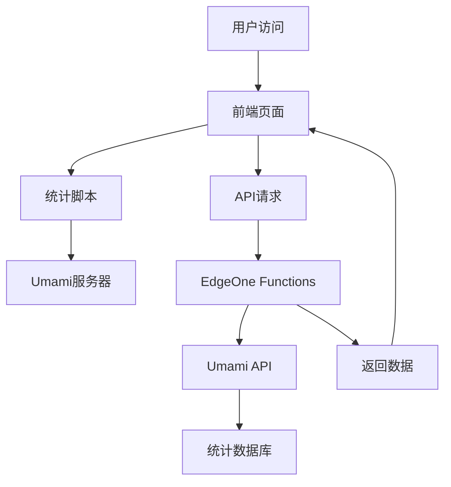

# 博客网站统计功能实现完整指南

在现代博客网站中，统计功能是不可或缺的一部分。它不仅能帮助作者了解文章的受欢迎程度，还能为网站优化提供数据支持。本文将详细介绍如何为博客网站实现完整的统计功能。

## 目录

1. [功能概述](#功能概述)
2. [技术架构设计](#技术架构设计)
3. [前端统计展示](#前端统计展示)
4. [API接口设计](#api接口设计)
5. [数据存储方案](#数据存储方案)
6. [实际代码实现](#实际代码实现)
7. [性能优化](#性能优化)
8. [常见问题解决](#常见问题解决)

## 功能概述

### 核心功能需求

- **页面浏览量（PV）**：统计每篇文章的总访问次数
- **独立访客数（UV）**：统计访问文章的独立用户数量
- **实时数据更新**：支持统计数据的实时展示
- **统一数据格式**：确保文章卡片和文章内页数据一致

### 技术选型

| 技术栈 | 用途 | 优势 |
|--------|------|------|
| Astro | 前端框架 | 静态生成，性能优秀 |
| Umami | 统计服务 | 隐私友好，开源免费 |
| EdgeOne Functions | 后端API | 边缘计算，响应快速 |
| JavaScript | 前端交互 | 原生支持，兼容性好 |

## 技术架构设计

### 整体架构图



### 数据流设计

1. **数据收集**：用户访问触发统计脚本
2. **数据存储**：Umami服务器记录访问数据
3. **数据查询**：前端通过API获取统计数据
4. **数据展示**：在页面上实时显示统计结果

## 前端统计展示

### 文章卡片统计

```astro
<!-- PostCard.astro -->
<div class="flex items-center gap-4 mt-3">
    <div class="flex items-center">
        <div class="meta-icon">
            <Icon name="material-symbols:bar-chart-4-bars-rounded" class="text-xl"></Icon>
        </div>
        <div id={`post-views-${entry.slug}`} class="transition text-50 text-sm font-medium whitespace-nowrap">--</div>
    </div>
    <div class="flex items-center">
        <div class="meta-icon">
            <Icon name="material-symbols:group-rounded" class="text-xl"></Icon>
        </div>
        <div id={`post-visitors-${entry.slug}`} class="transition text-50 text-sm font-medium whitespace-nowrap">--</div>
    </div>
</div>
```

### 统计数据获取脚本

```javascript
// 获取文章统计数据
async function fetchPostStats(postUrl, postSlug) {
    const viewsEl = document.getElementById(`post-views-${postSlug}`);
    const visitorsEl = document.getElementById(`post-visitors-${postSlug}`);
    
    // 显示加载状态
    if (viewsEl) viewsEl.textContent = '加载中...';
    if (visitorsEl) visitorsEl.textContent = '加载中...';
    
    try {
        const endpoint = `/api/stats?url=${encodeURIComponent(postUrl)}`;
        const response = await fetch(endpoint, {
            method: 'GET',
            headers: {
                'Accept': 'application/json',
                'Content-Type': 'application/json'
            }
        });
        
        if (!response.ok) {
            throw new Error(`HTTP ${response.status}: ${response.statusText}`);
        }
        
        const data = await response.json();
        
        if (data.error) {
            throw new Error(data.error);
        }
        
        const pageviews = Number(data?.pageviews || 0);
        const visitors = Number(data?.visitors || 0);
        
        // 更新显示
        if (viewsEl) {
            viewsEl.textContent = pageviews > 0 ? `${pageviews} 次浏览` : '暂无数据';
            viewsEl.classList.remove('text-50');
            viewsEl.classList.add(pageviews > 0 ? 'text-90' : 'text-60');
        }
        
        if (visitorsEl) {
            visitorsEl.textContent = visitors > 0 ? `${visitors} 位访客` : '暂无数据';
            visitorsEl.classList.remove('text-50');
            visitorsEl.classList.add(visitors > 0 ? 'text-90' : 'text-60');
        }
        
    } catch (error) {
        console.error('Failed to fetch stats:', error);
        
        // 显示错误状态
        if (viewsEl) {
            viewsEl.textContent = '--';
            viewsEl.classList.add('text-60');
        }
        if (visitorsEl) {
            visitorsEl.textContent = '--';
            visitorsEl.classList.add('text-60');
        }
    }
}
```

## API接口设计

### EdgeOne Functions API

```javascript
// api/stats.js
export default async function onRequest(context) {
    const { request, env } = context;
    const url = new URL(request.url);
    const targetUrl = url.searchParams.get('url');
    
    if (!targetUrl) {
        return new Response(JSON.stringify({ error: 'URL parameter is required' }), {
            status: 400,
            headers: { 'Content-Type': 'application/json' }
        });
    }
    
    try {
        // 构建Umami API请求
        const umamiUrl = `${env.UMAMI_API_URL}/api/websites/${env.UMAMI_WEBSITE_ID}/stats`;
        const response = await fetch(umamiUrl, {
            method: 'GET',
            headers: {
                'Authorization': `Bearer ${env.UMAMI_API_TOKEN}`,
                'Content-Type': 'application/json'
            },
            params: {
                url: targetUrl,
                startAt: 0,
                endAt: Date.now(),
                unit: 'day'
            }
        });
        
        if (!response.ok) {
            throw new Error(`Umami API error: ${response.status}`);
        }
        
        const data = await response.json();
        
        return new Response(JSON.stringify({
            pageviews: data.pageviews || 0,
            visitors: data.visitors || 0
        }), {
            status: 200,
            headers: { 
                'Content-Type': 'application/json',
                'Cache-Control': 'max-age=300' // 缓存5分钟
            }
        });
        
    } catch (error) {
        console.error('Stats API error:', error);
        
        return new Response(JSON.stringify({
            error: 'Failed to fetch statistics',
            pageviews: 0,
            visitors: 0
        }), {
            status: 500,
            headers: { 'Content-Type': 'application/json' }
        });
    }
}
```

### API响应格式

```json
{
    "pageviews": 213,
    "visitors": 18
}
```

## 数据存储方案

### Umami配置

```javascript
// umami配置
const umamiConfig = {
    websiteId: 'your-website-id',
    apiUrl: 'https://your-umami-instance.com',
    domains: 'your-domain.com',
    autoTrack: true,
    cache: true
};
```

### 环境变量设置

```bash
# .env
UMAMI_WEBSITE_ID=your-website-id
UMAMI_API_TOKEN=your-api-token
UMAMI_API_URL=https://your-umami-instance.com
```

## 实际代码实现

### 文章内页统计

```astro
<!-- PostMeta.astro -->
---
interface Props {
    // ... 其他属性
    hideStats?: boolean;
}
const { hideStats = false } = Astro.props;
---

{!hideStats && (
    <div class="flex items-center gap-4">
        <div class="flex items-center">
            <div class="meta-icon">
                <Icon name="material-symbols:bar-chart-4-bars-rounded" class="text-xl"></Icon>
            </div>
            <div id="post-views" class="transition text-50 text-sm font-medium whitespace-nowrap">--</div>
        </div>
        <div class="flex items-center">
            <div class="meta-icon">
                <Icon name="material-symbols:group-rounded" class="text-xl"></Icon>
            </div>
            <div id="post-visitors" class="transition text-50 text-sm font-medium whitespace-nowrap">--</div>
        </div>
    </div>
)}

<script is:inline define:vars={{ shouldShowStats: !hideStats }}>
if (shouldShowStats) {
    (async () => {
        const viewsEl = document.getElementById('post-views');
        const visitorsEl = document.getElementById('post-visitors');
        
        if (viewsEl) viewsEl.textContent = '加载中...';
        if (visitorsEl) visitorsEl.textContent = '加载中...';
        
        try {
            // 解码URL以确保与PostCard格式一致
            const currentPath = decodeURIComponent(window.location.pathname);
            const endpoint = `/api/stats?url=${encodeURIComponent(currentPath)}`;
            
            const response = await fetch(endpoint, {
                method: 'GET',
                headers: {
                    'Accept': 'application/json',
                    'Content-Type': 'application/json'
                }
            });
            
            if (!response.ok) {
                throw new Error(`HTTP ${response.status}: ${response.statusText}`);
            }
            
            const data = await response.json();
            
            if (data.error) {
                throw new Error(data.error);
            }
            
            const pv = Number(data?.pageviews || 0);
            const uv = Number(data?.visitors || 0);
            
            if (viewsEl) {
                viewsEl.textContent = pv > 0 ? `${pv} 次浏览` : '暂无数据';
                viewsEl.classList.remove('text-50');
                viewsEl.classList.add(pv > 0 ? 'text-90' : 'text-60');
            }
            
            if (visitorsEl) {
                visitorsEl.textContent = uv > 0 ? `${uv} 位访客` : '暂无数据';
                visitorsEl.classList.remove('text-50');
                visitorsEl.classList.add(uv > 0 ? 'text-90' : 'text-60');
            }
            
        } catch (error) {
            console.error('Failed to fetch stats:', error);
            
            if (viewsEl) {
                viewsEl.textContent = '--';
                viewsEl.classList.add('text-60');
            }
            if (visitorsEl) {
                visitorsEl.textContent = '--';
                visitorsEl.classList.add('text-60');
            }
        }
    })();
}
</script>
```

## 性能优化

### 1. 缓存策略

```javascript
// API响应缓存
headers: {
    'Cache-Control': 'max-age=300, s-maxage=600',
    'CDN-Cache-Control': 'max-age=3600'
}
```

### 2. 异步加载

```javascript
// 延迟加载统计数据
setTimeout(() => {
    fetchPostStats(postUrl, postSlug);
}, 100);
```

### 3. 错误处理

```javascript
// 优雅降级
const MAX_RETRIES = 3;
let retryCount = 0;

async function fetchStatsWithRetry(url) {
    try {
        return await fetchStats(url);
    } catch (error) {
        if (retryCount < MAX_RETRIES) {
            retryCount++;
            await new Promise(resolve => setTimeout(resolve, 1000 * retryCount));
            return fetchStatsWithRetry(url);
        }
        throw error;
    }
}
```

## 常见问题解决

### 1. URL编码不匹配

**问题**：文章内外统计数据不一致

**解决方案**：
```javascript
// 统一URL格式
const currentPath = decodeURIComponent(window.location.pathname);
const endpoint = `/api/stats?url=${encodeURIComponent(currentPath)}`;
```

### 2. 统计脚本加载失败

**问题**：Umami脚本无法初始化

**解决方案**：
```javascript
// 检查脚本加载状态
function waitForUmami() {
    if (window.umami && typeof window.umami.track === 'function') {
        console.log('[Umami] Ready for tracking');
        return true;
    }
    
    if (retryCount < maxRetries) {
        retryCount++;
        setTimeout(waitForUmami, 500);
    } else {
        console.warn('[Umami] Failed to initialize');
    }
    return false;
}
```

### 3. API请求超时

**问题**：统计数据加载缓慢

**解决方案**：
```javascript
// 设置请求超时
const controller = new AbortController();
const timeoutId = setTimeout(() => controller.abort(), 5000);

try {
    const response = await fetch(endpoint, {
        signal: controller.signal,
        timeout: 5000
    });
} finally {
    clearTimeout(timeoutId);
}
```

## 总结

通过本文的详细介绍，我们完成了博客网站统计功能的完整实现：

1. **前端展示**：统一的统计数据展示组件
2. **API设计**：高效的数据获取接口
3. **性能优化**：缓存、异步加载、错误处理
4. **问题解决**：常见问题的诊断和修复

这套统计系统不仅功能完善，还具有良好的用户体验和系统稳定性。希望这个指南能帮助你为自己的博客网站添加专业的统计功能！

## 相关资源

- [Umami官方文档](https://umami.is/docs)
- [Astro官方文档](https://docs.astro.build)
- [EdgeOne Functions文档](https://cloud.tencent.com/document/product/1552)
